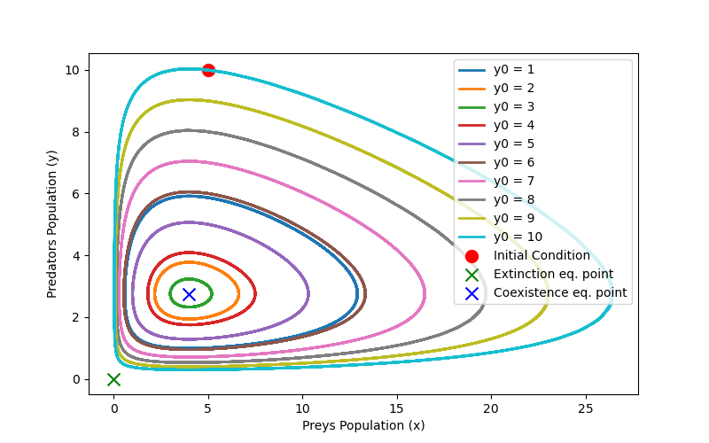

# Lotka-Volterra model

The Lotka-Volterra model, names after Alfred Lotka and Vito Volterra, is a set of differential equations used to describe the dynamics of biological systems, particularly in the context of predator-prey relationships. It's a fundamental tool in ecology and population biology for understanding how the populations of species interact with each other over time. 

The aim of this project is to simulate the Lotka-Volterra model for *two species*. The goal is to offers a quantitative understanding of the dynamics within a simplified predator-prey ecosystem and to convey these dynamics visually through animations. These animations will depict the fluctuations in both predator and prey populations over time and demonstrate their interdependence in phase space.

To clone the repository and initiate the simulation, the user should utilize the specified command lines syntax, subsequently enabling the visualization of the interactive plot and of the animations of teh Lotka-Volterra model:

    gitclone https://github.com/noemisgambelluri/Lotka_Volterra-model.git
    cd Lotka_Volterra-model

    python Simulation.py settings.ini
    python InteractivePlot.py setting.ini
    python Animation_1.py settings.ini
    python Animation_2.py settings.ini

## Introduction to the model

The lotka-volterra equations are a pair of first-order nonlinear differential equations used to  describe predator-prey interaction, in particular how one population is affected by the other and vicevrsa. the population change through time according to the pair of equations:

$$\frac{dx}{dt} = \alpha x - \beta xy$$
$$\frac{dy}{dt} = \delta x y - \gamma y$$

where 
* the variable *x* is the population density of **prey** (for example, the number of fishes per square kilometre);
* the variable *y* is the population density of some **predator** (for example, the number of bears per square kilometre);
* $\frac{dy}{dt}$ and $\frac{dx}{dt}$ represent the instantaneous growth rates of the two populations;
* *t* represents time;
* The prey's parameters, $\alpha$ and $\beta$, describe, respectively, the maximum prey per capita growth rate, and the effect of the presence of predators on the prey growth rate.
* The predator's parameters, $\gamma$, $\delta$, respectively describe the predator's per capita death rate, and the effect of the presence of prey on the predator's growth rate.
All parameters are positive and real.

The solution of the differential equations is deterministic and continuous. This, in turn, implies that the generations of both the predator and prey are continually overlapping.

### Model Assumptions

The prey are assumed to have unlimtide food supply and to reproduce exponentially, unless subject to predation. This is mathematically expressed by the $\alpha x$ term in the equation above. The predation rate is assumed to be proportional to the encounter rate between the species, mathematically represented by the term $\beta x y$. The action of "predation" no longer exists as soon as one or both species is exinct (*x* = 0, *y* = 0). Furthermore, the prey's population rate of change is given by its own growth rate minus the rate at which it is preyed upon.

The growth of the predator population is mathematically represented by the term $\delta x y$ (note that a different constant is used compared to the predation rate, as the rate at which the predator population grows is not necessarily equal to the rate at which it consumes the prey). The loss rate of the predators due to either natural death or emigration is mathematically described by the term $\gamma y$. This term exponentially decay i absence of prey. Furthermore, the equation expresses that the rate of change of the predator's population depends upon the rate at which it consumes prey, minus its intrinsic death rate.

In this frame, the Lotka-Volterra model is based on the following assumptions regarding environment and biology of the two species populations:
* The food supply of the predator population depends entirely on the size of the prey population;
* The prey population finds ample food at all times;
* The rate of change of population is proportional to its size;
* During the process, the environment does not change in favour of one species, and genetic adaptation is inconsequential;
* Predators have limitless appetite;
* Both populations can be described by a single variable. This amounts to assuming that the populations do not have a spatial or age distribution that contributes to the dynamics.

## Model Simulation

The steps of this simulation are structured to be followed in order to allow the user to better understand the functioning of the Lotka-Volterra model. 

1. The user has to set the model parameters in the [settings](https://github.com/noemisgambelluri/Lotka_Volterra-model/raw/main/settings.ini) file. In particular, the user has to choose: the Lotka-Volterra model parameters, hence $\alpha$ (prey per capita growth rate), $\beta$ (the effect of the presence of predators on the prey growth rate), $\gamma$ (predators per capita death rate), $\delta$ (the effect of the presence of prey on the predator's growth rate), the initial populations of preys $x_{0}$ and predators $y_{0}$, the maximum time of observation t_max and the total number of time points for which the simulation is going to be ran num_points. It is suggested to keep parameters below 2.0, hower there are no specific constraints. 

2. The user has to launch the [Simulation](https://github.com/noemisgambelluri/Lotka_Volterra-model/raw/main/Simulation.py) file through which parameters from the [settings](https://github.com/noemisgambelluri/Lotka_Volterra-model/raw/main/settings.ini) file are imported exploiting the ConfigParser library, simulate the Lotka-Volterra model equations with the chosen initial conditions and visualize them in two different plots. The first plot is a dynamic representation of Lotka-Volterra equations, showing the rates of change of each population as a function of time, as shown in figure . The second plot is a representation of the Predators Population as a function of the Prey Population, to highlight their intertwined interaction, as shown in figure . 

## Project structure

This project contains 7 files:

1. [settings](https://github.com/noemisgambelluri/Lotka_Volterra-model/raw/main/settings.ini)
